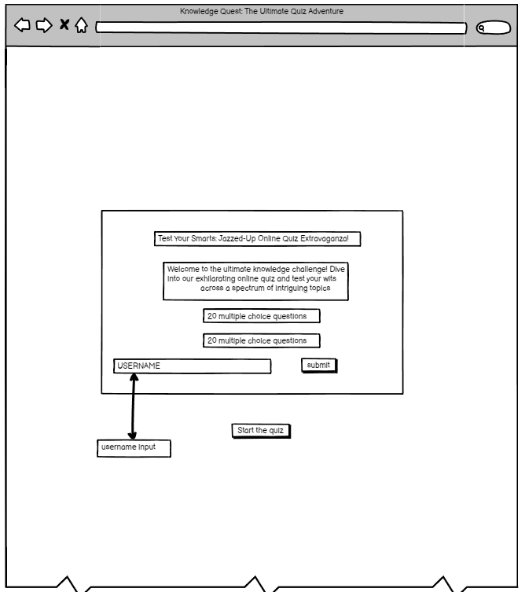

# __Knowledge Quest: The Ultimate Quiz Adventure - Portfolio Project 2__
Welcome to Knowledge Quest, an exhilarating online quiz that tests your knowledge across a diverse array of topics. Dive into this engaging experience where you can challenge yourself with 20 multiple-choice questions covering various subjects. With Knowledge Quest, embark on a journey to discover new facts, sharpen your intellect, and enjoy the thrill of learning in a fun and interactive way. 

**Aims:**

**Educational Engagement:** Knowledge Quest aims to provide an educational and entertaining platform where users can enhance their knowledge while enjoying themselves.

**Interactive Learning:** Through interactive quizzes, users can actively engage with the content, promoting effective learning and retention.

**Topic Diversity:** The quiz covers a broad spectrum of topics, catering to different interests and encouraging exploration of diverse subjects.

**Feedback Mechanism:** Users receive immediate feedback on their responses, allowing them to track their progress and learn from their mistakes.

**User-Friendly Experience:** Knowledge Quest offers a user-friendly interface, making it accessible and enjoyable for users of all ages and backgrounds.

**How It Works:** Users begin by creating a username to personalize their quiz experience.

**Quiz Interface:** The quiz interface presents users with a series of multiple-choice questions, each accompanied by four answer options.

**Answer Selection:** Users select their answers by clicking on the corresponding buttons.

**Immediate Feedback:** Upon selecting an answer, users receive immediate feedback indicating whether their response was correct or incorrect.

**Score Tracking:** The quiz tracks users' scores as they progress through the questions, providing a final score at the end of the quiz

**End of Quiz:** After completing all questions, users receive their final score.

### __Wireframes__

I used Balsamiq to create wireframes for the page.

![]