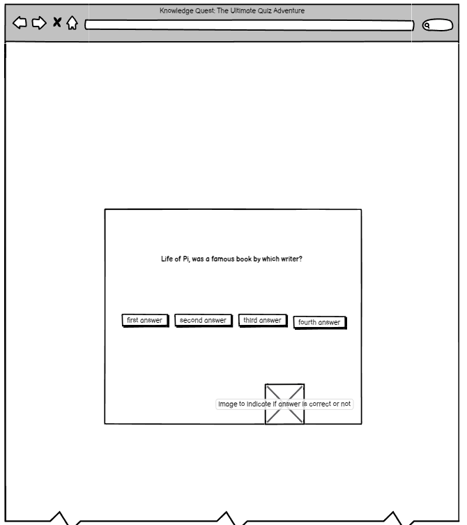
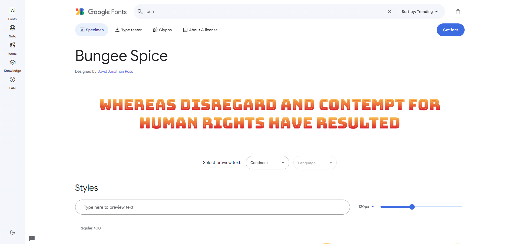
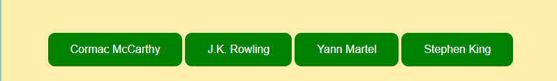
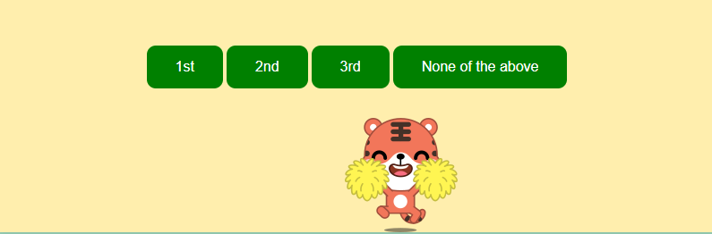
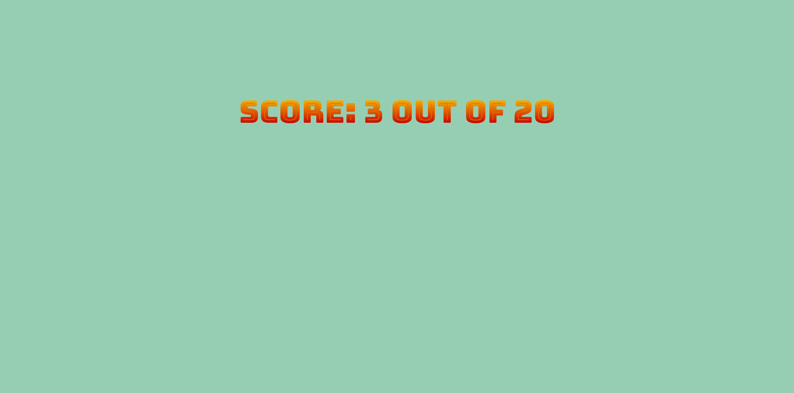
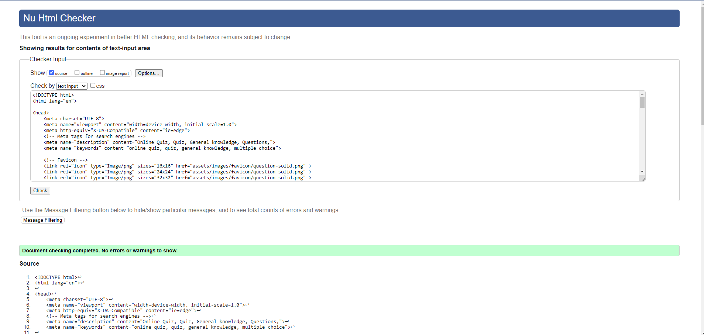
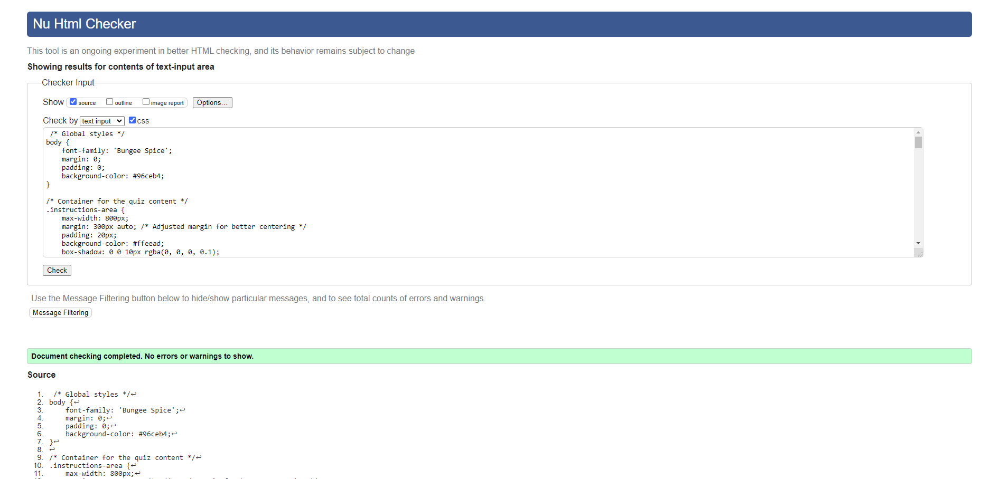
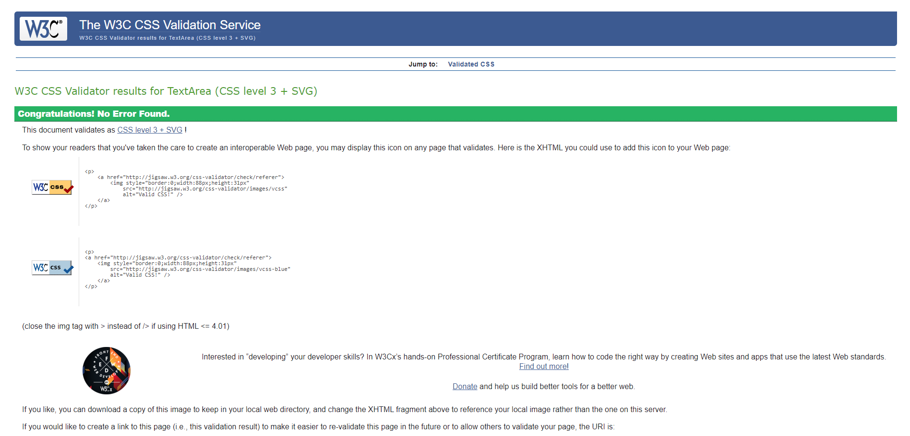

# __Knowledge Quest: The Ultimate Quiz Adventure - Portfolio Project 2__
Welcome to Knowledge Quest, an exhilarating online quiz that tests your knowledge across a diverse array of topics. Dive into this engaging experience where you can challenge yourself with 20 multiple-choice questions covering various subjects. With Knowledge Quest, embark on a journey to discover new facts, sharpen your intellect, and enjoy the thrill of learning in a fun and interactive way. 

## **Aims:**

**Educational Engagement:** Knowledge Quest aims to provide an educational and entertaining platform where users can enhance their knowledge while enjoying themselves.

**Interactive Learning:** Through interactive quizzes, users can actively engage with the content, promoting effective learning and retention.

**Topic Diversity:** The quiz covers a broad spectrum of topics, catering to different interests and encouraging exploration of diverse subjects.

**Feedback Mechanism:** Users receive immediate feedback on their responses, allowing them to track their progress and learn from their mistakes.

**User-Friendly Experience:** Knowledge Quest offers a user-friendly interface, making it accessible and enjoyable for users of all ages and backgrounds.

**How It Works:** Users begin by creating a username to personalize their quiz experience.

**Quiz Interface:** The quiz interface presents users with a series of multiple-choice questions, each accompanied by four answer options.

**Answer Selection:** Users select their answers by clicking on the corresponding buttons.

**Immediate Feedback:** Upon selecting an answer, users receive immediate feedback indicating whether their response was correct or incorrect.

**Score Tracking:** The quiz tracks users' scores as they progress through the questions, providing a final score at the end of the quiz

**End of Quiz:** After completing all questions, users receive their final score.

### __Wireframes__

I used Balsamiq to create wireframes for the page.

    

## **Design**

### __Colour scheme__

I chose the below colour scheme as it felt warm and fun.

### __Typography__

I chose the Bungee Spice font as I felt it went well with the colours selected. I got the font from Google Fonts.

## **Features:**

Create username and then begin the quiz with the buttons shown above.

Answer the questions by choosign one of the buttons above.

If the correct answer is picked the graphic above is shown.

If the incorrect answer is picked the graphic above is shown.

Final score shown on last page.

## **Technologies and languages used**

* Github - Used for storage of my site and for publishing online. 
* HTML5 - The core of the site was built with HTML version 5.
* CSS - CSS was used to style the website and define fonts and layout.
* Python - Used python 3 via the terminal to preview my site using a local http server.

## **Deployment and local development**

I deployed everything my website onto gitpages.

How to Clone Log into your account on github:

Go to the repository of this project [Quiz Project](https://github.com/Markmcl25/project-2.git) Click on the code button, and copy your preferred clone link. Open the terminal in your code editor and change the current working directory to the location you want to use for the cloned directory. Type 'git clone' into the terminal, paste the link you copied in step 3 and press enter.

## **Validating**

I tested the code using Nu Html Checker.

## **Testing**

Each device tested the site using the following browsers:

Google Chrome, Firefox.

## **Credits**

* Font Awesome - Social Media icons from Font Awesome.
* Google Chrome - The website was built and tested in google Chrome.
* Google font - For the font within the quiz.
* Wordpress.com - For markdown info and tips.
* Balsamiq.cloud - For the wireframes. 
* Vectezzy.com - Images for correct/ incorrect answer